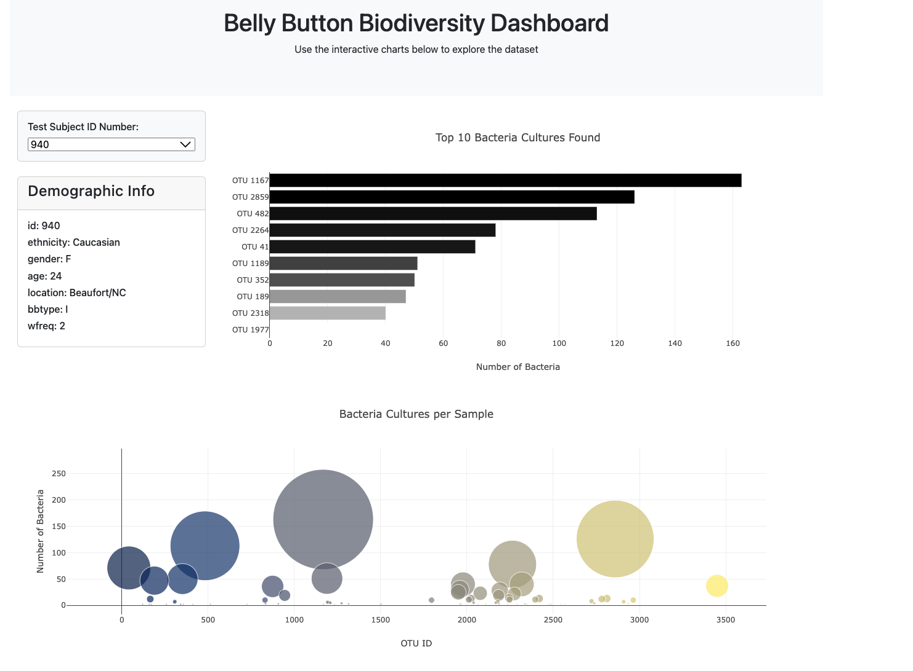

# belly-button-challenge
#### Module 14

In this assignment, we built an interactive dashboard using D3 and Plotly to visualize the Belly Button Biodiversity dataset, which catalogs the microbes that colonize human navels.

The dataset reveals that a small handful of microbial species (also called operational taxonomic units, or OTUs, in the study) were present in more than 70% of people, while the rest were relatively rare.

We implemented a dropdown menu to select different test subjects and dynamically updated the metadata panel, a bar chart displaying the top 10 bacterial cultures, and a bubble chart representing all bacterial cultures per sample. The visualizations were styled with color scales for better readability.

